# PHP WEB

<center>

## POINT UTAMA

</center>

### 1. Pengenalan Web

- Web merupakan kumpulan informasi yang tersedia dalam sebuah komputer yang terkoneksi secara terus menerus melalui internet.

- Web bisa berisi informasi dalam bentuk apapun, termasuk teks, musik, vidio dll.

- Web berjalan di aplikasi yang bernama `Web Server`, yang digunakan untuk menyimpan dan menyampaikan isi informasi web.

- Pihak penyedia komputer untuk _web server_ biasa disebut `web host`.

- Setiap web memiliki alamat IP yang berbeda, seperti 172.217.194.94

- Dikarenakan menghapal alamat IP sangat menyulitkan untuk diingat, ada yang namanya `doamin`.

- `Domain` adalah alias yang digunakan untuk ke IP address, seperti Google.com, blibli.com dll.

---

### 2. PHP Web

1. Client & Server

   - Client server adalah konsep arsitektur yang yang menghubungkan antara kedua belah pihak, yaitu sistem client & sistem server.

   - `Aplikasi clien` bertugas mengirim _request_ ke server dan menerima serponse dari server.

   - Sedangkan, `aplikasi server` bertugas menerima _request_ dari client, memproses data, dan mengembalikan hasil data ke client.

   - Contoh aplikasi yang bertugas sebagai `Client` adalah, web browser seperti Chrome, Firefox, Edge dll .

   - Sementara aplikasi sebagai `server` adalah web server.

---

### 3. Cara Kerja PHP Web

- Permintaan: Pengguna mengirimkan permintaan HTTP.

- Server: Menerima permintaan dan menjalankan kode PHP.

- PHP: Eksekusi kode, interaksi dengan basis data, dan logika bisnis.

- Respons: Hasilnya dikirimkan kembali ke klien.

- Tampilan: Klien menerima dan menampilkan halaman web.

---

### 4. PHP Development Server

- Di komputer pribadi, kita bisa gunakan _host_ dangan nama _localhost_.

- Contoh `php -S localhost:8080`.

---

### 5. Hot Reload

- PHP merupakan bahasa pemograman yang tidak perlu di _compile_ terlebih dahulu.

- PHP juga mendukung _Hot Reload_, yang artinya setiap perubahan yang terjadi dikode editor bisa kita liat perubahannya dengan cara merefresh web browsernya saja.

---

### 6. Menjalankan PHP Web Hello World

- Untuk mengakses file php yang sudah kita buat, bisa meggunakan web browser dengan url `http://localhost:8080/nama-file.php`.

---

### 7. PHP Info

- PHP memiliki fitur `info`, yang bisa digunakan untuk mengecek versi PHP dan fitur apa saja yang tersedia di aplikasi PHP yang kita install.

- Kita bisa ketik `php --info` di terminal atau menggunakan PHP web dengan mengetikan `function phpinfo()`.

  ```PHP
  phpinfo();
  ```

  

---

### 8. Integrasi Dengan HTML

- PHP secara default terintegrasi dengan baik dengan HTML.

- Dengan begitu kita bisa membuat website dinamis dan bisa berubah - ubah sesuai dengan kode dan logika pemograman kita.

- Dengan menggunakan tag `<?` diakhir `/>` artinya kita bisa memasukan kode PHP didalam HTML.

  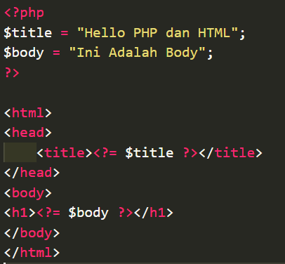

- Selain HTML, PHP juga terintegrasi dengan CSS, JavaScript, Image, Vidio dll.

---

### 9. Global Variable Server

- Di PHP terdapat global variable `$_SERVER`.

- `$_SERVER` merupakan _array_ yang berisi informasi seperti HTTP Header, path, lokasi script php, dll.

- menampilkan isi `$_SERVER`

  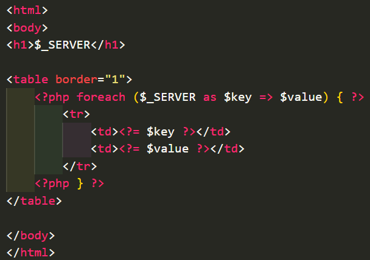

  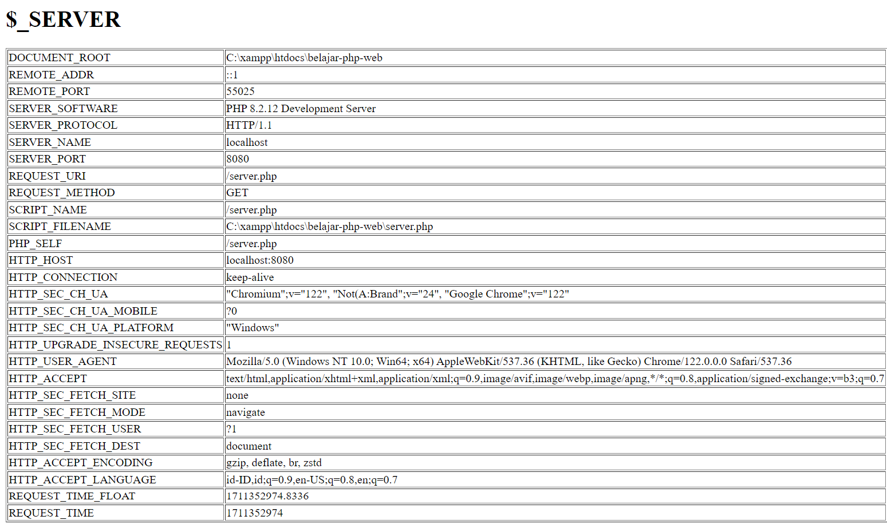

---

### 10. Query Parameter

- Saat mengakses web kita kan menggunakan _URL_, nah didalam _URL_ terdapat `query parameter`.

- yang merupakan informasi tambahan yang bisa kita kirim ke `client server` secara dinamis.

- untuk menambahkan `query parameter`cukup gunakan `?` diikuti dengan `key=value` pada _URL_.

- Di PHP, semua `query parameter` akan secara otomatis disimpan si global variable bernama `$_GET`.

  1. `$_GET` adalah global varibale berupa _array_.

  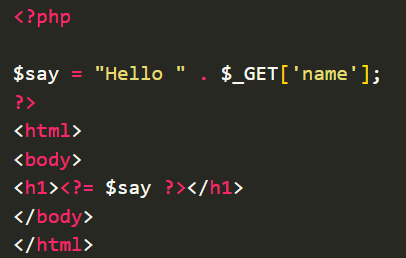

Tampilan


- Multiple Query Parameter

  1. `Query Parameter` bisa memiki banyak parameter

  2. Kita cukup tambahkan `&` diikuti dengan `query parameter` selanjutnya.

  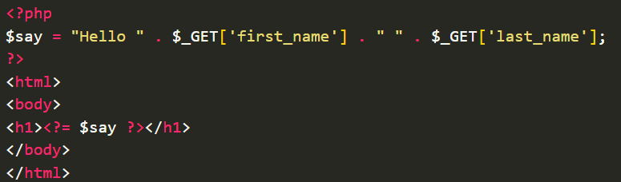

Tampilan


- Query Parameter Array

  1. Di PHP bisa mengirim `query parameter` dengan data lebih dari satu.

  2. Data tersebut otomatis terkonversi menjadi _array_.

  3. Caranya dengan menambahkan `[]` diakhir nama `query parameter` nya.

  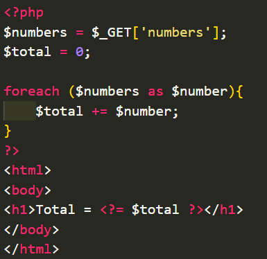

Tampilan
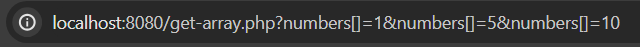

---

### 11. Close Site Scripting

- `XSS` merupakan celah keamanan yang biasanya dilakukan dengan menirim script apa parameter.

- Hal ini sangat berbahaya karena hacker bisa mencuri _session_ pengguna yang sedang login.

- Cara mencegahnya, kita perlu berhati-hati ketika ingin menampilakan inputan yang berasal dari user.

- Kita bisa menambahakan _function_ `htmlspecialchars(value)`.

- Secara otomatis `htmlspecialchars` akan melakukan encode character di HTML agar dirender menjadi text biasa.

  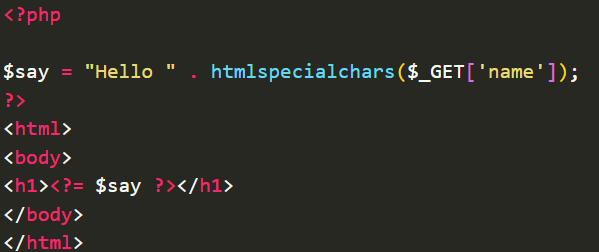

---

### 12. Form Post

- Tag `form` di HTML digunakan untuk mengirim data Client ke Server.

- Di PHP bagusnya kita menggunakan `$_POST`, karena secara otomatis request dari Client ke Server akan berubah HTTP POST, ini membuat data yang dikkirim melalui `body` bukan parameter.

- `$_POST` adalah global varible yang berisikan data _array_ yang dikirim dari Client ke Server dalam bentuk POST.

  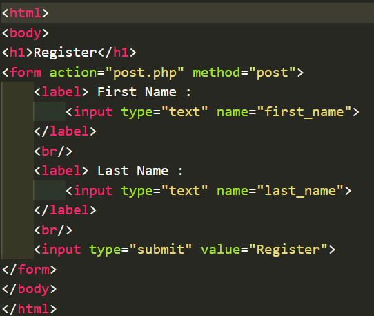

- Cara menerima Input

  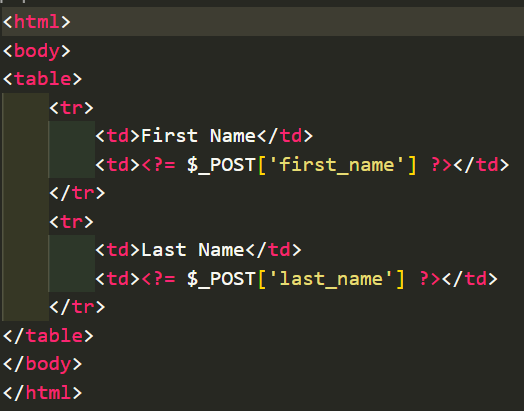

---

### 13. Header

- Header biasnya digunakan sebagai tempat menyimpan informasi tambahan diluar _URL_, _METHOD_ & _BODY_, didalam HTTP request.

- Menangkap Header

  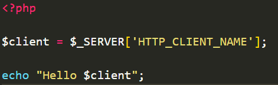

- Menambah Header Response

  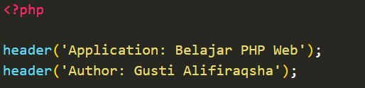

---

### 14. Redirect

- Redirect dari satu halaman ke halaman lain bisa dilakukan dengan mengirimkan header `Location` dalam respons HTTP.

- Redirect local

  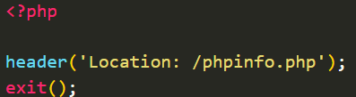

- Redirect Eksternal

  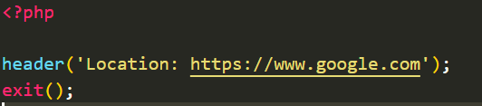

---

### 15. Respone Code

- Secara default, di PHP respone code adalah `200 OK`.

- Gunakan `http_respone_code()` untuk menngubahnya.

  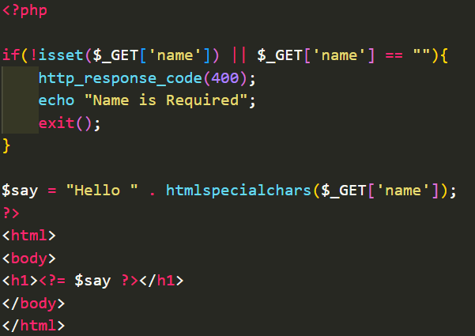

---

### 16. Session

- `Session` adalah mekanisme yang digunakan untuk mengingat interkasi sebelumnya dari Client.

- Ketika menggunakan session dalam PHP untuk proses login, informasi login dapat disimpan di sisi server dan dikirimkan kembali ke browser untuk disimpan.

- `$_SESSION` juga merupaka globla variable _array_ yang berisi data session.

- Gunakan perintah `session_start()` untuk memulai session.

- Halaman Login

  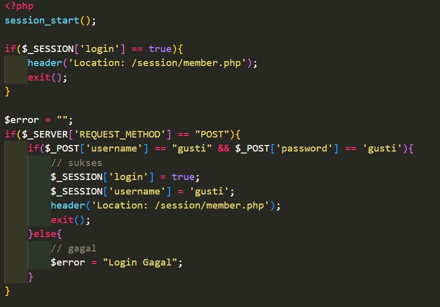

- Halaman Member

  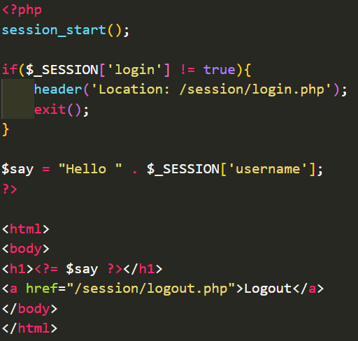

- Halaman Logout

  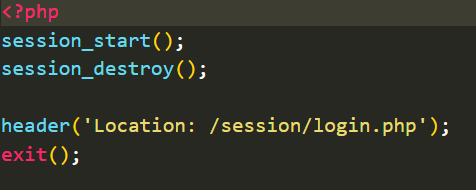

- Masalah dengan PHP session

  1. PHP menyimpan session di file.

  2. Tidak direkomendasikan jika untuk menyimpan data yang besar, karena setiap melakukan `session_start()` maka akan meload dari file.

  3. Alternatif nya menggunakan management session seperti Secure cookie atau JWT.

---

### 17. Cookie

- `Cookie` adalah data dalam bentuk key-value yang dikirim oleh server pada HTTP response untuk disimpan di Clien(Web Browser).

- Hatilah dalam penggunaan cookie, hindari menyimpan terlalu banyak data di dalamnya karena semua data akan dikirim dalam setiap permintaan HTTP, yang dapat memperlambat kinerja.

- Di PHP bisa menggunakan _function_ `setcookie(..)`.

- Dan untuk membaca cookie yang dikirim Client, bisa di buka menggunakan global variable `$_COOKIE`.

  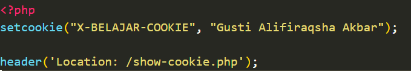

  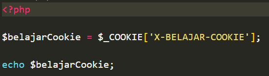

---

### 18. Session & Cookie

- `Session ID` dalam PHP disimpan di dalam Cookie dan digunakan sebagai identifier untuk file session di server.

- Di `PHP session ID` disimpan di Cookie dan digunakan untuk mengakses file session di server, menjadikannya erat terkait dengan cookies.

---

### 19. Upload File

- Kita bisa mengaupload gambar/vidio/music ke web PHP menggunakan global variable `$_FILES`.

- Kode from upload

  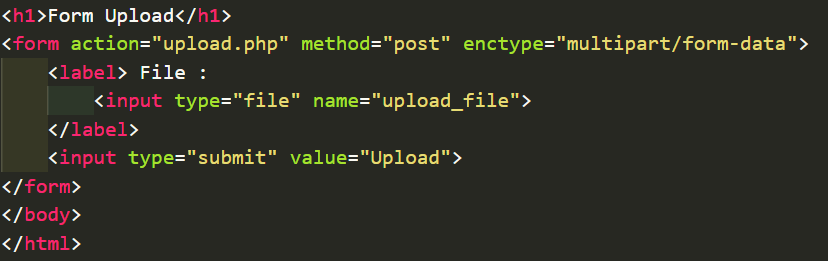

- Kode menerima file upload

  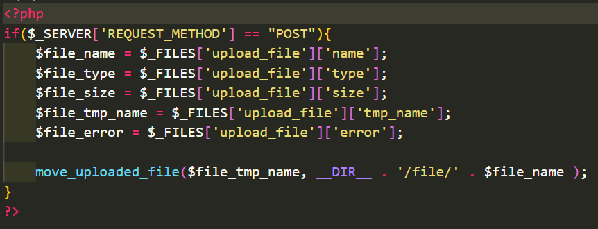

---

### 20. Download File

- Di PHP kita bisa menambahkan fitur dimana visitor jika ingin mendowload file dari web kita harus login terlebih dahulu.

- Menggunakan _function_ `readfile(filename)`.

- Kode untuk memaksa visitor mendownload file HTML.

  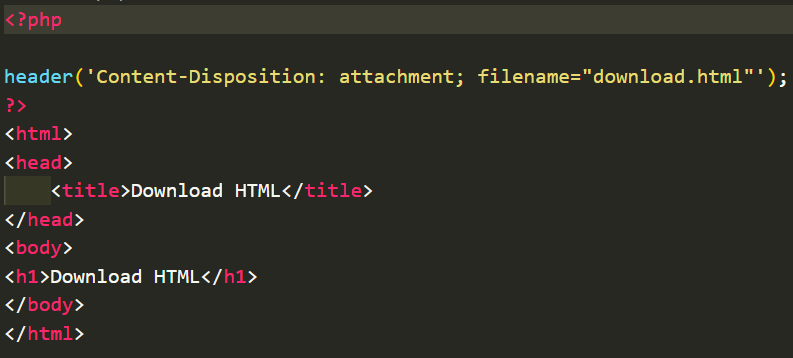

- Kode untuk mendowload file

  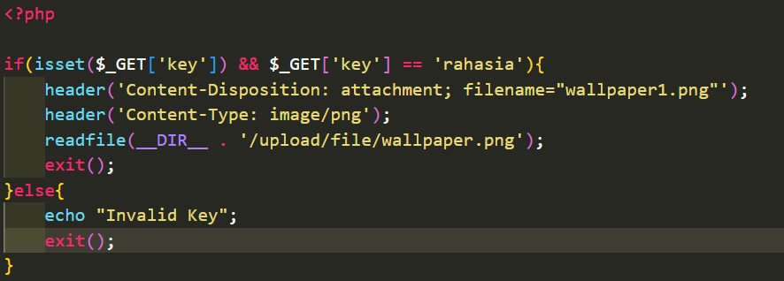

---

## Pertanyaan & Catatan Tambahan

- Tidak ada.

---

## Kesimpulan

- Vidio ini bertujuan memperkenalkan awal dan kode - kode awal pembuatan web menggunakan PHP.
